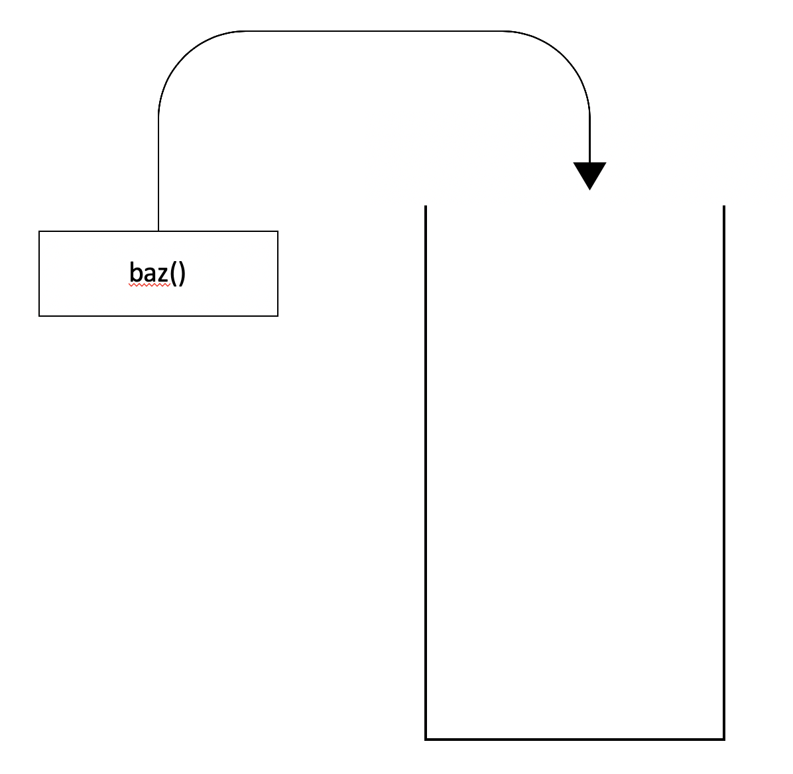
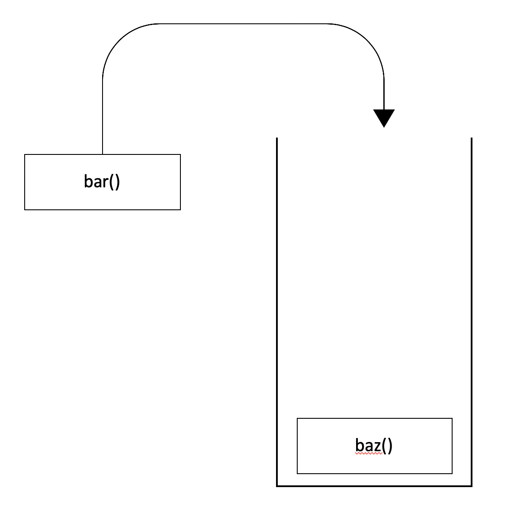
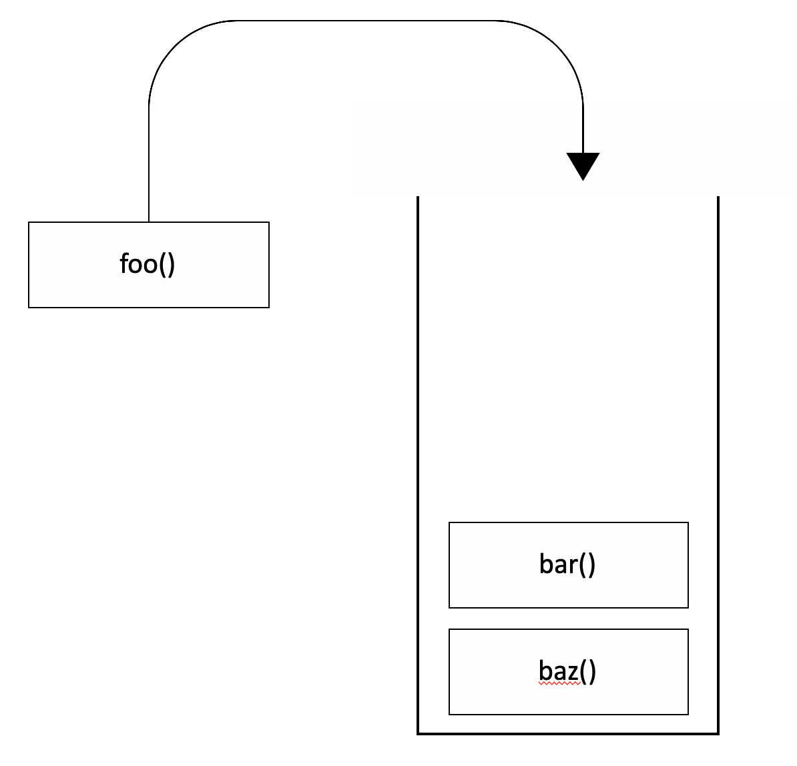
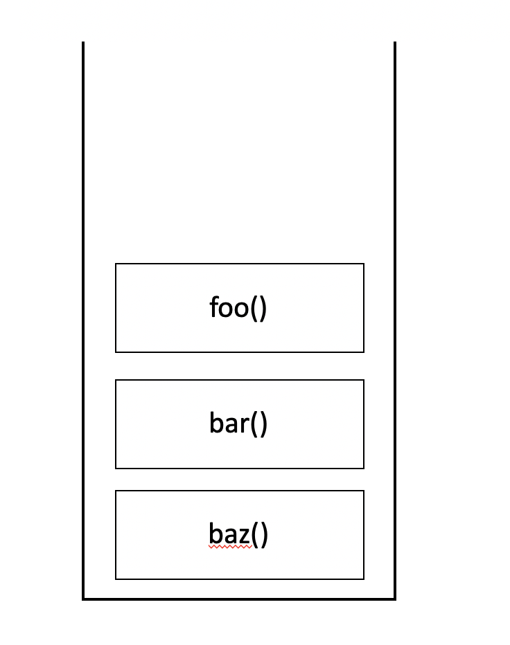
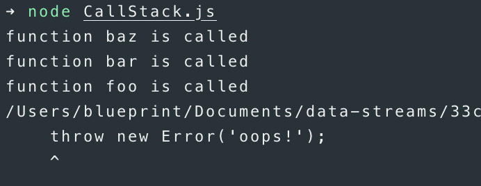
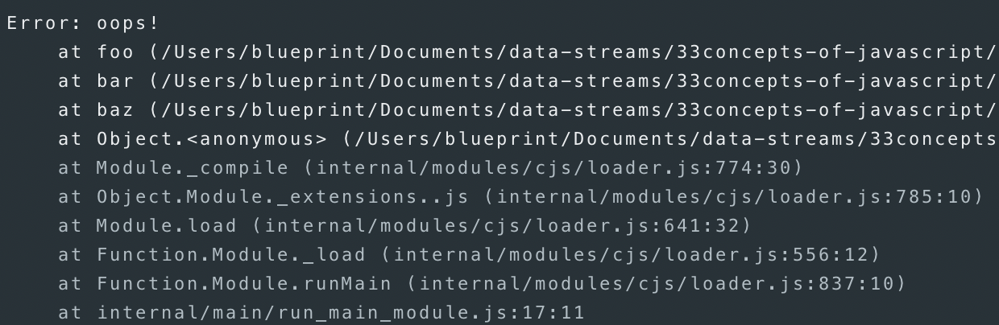
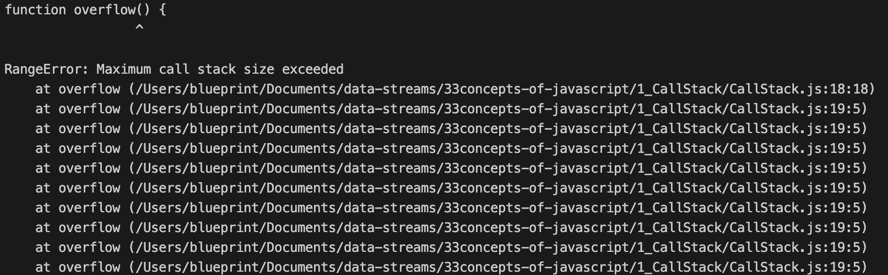
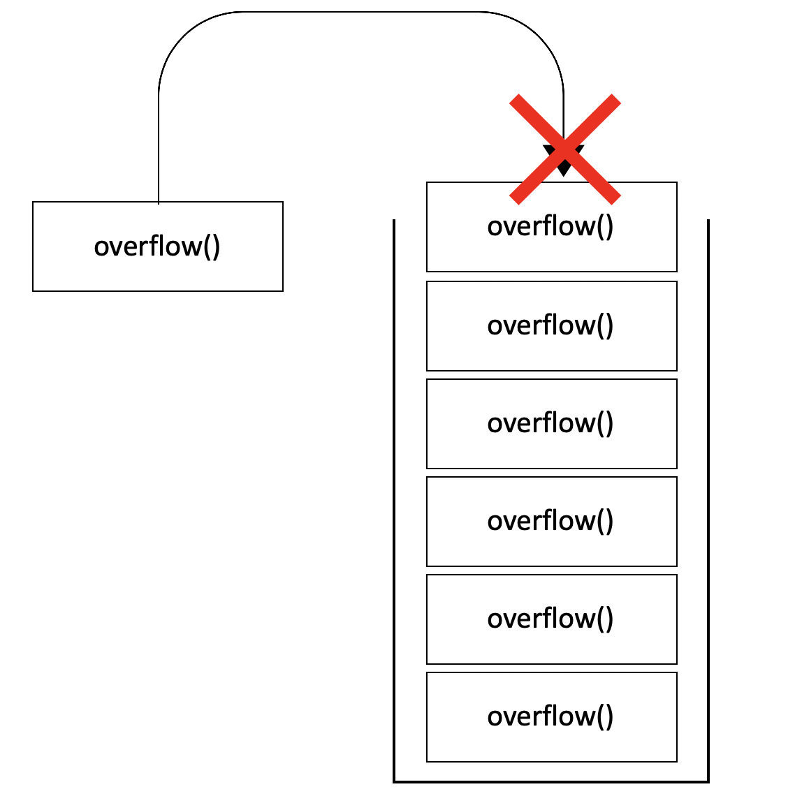

# 콜스택 (Call Stack)

## 콜스택이란?

함수(`function`)의 호출(`call`)을 기록하는 스택(`stack`)자료구조다.<br>

### 코드로 이해하기

아래의 간단한 코드를 이용해 `Call Stack`을 설명해보겠습니다.<br>

```javascript
function foo() {
    console.log('function foo is called');
    throw new Error('oops!');
}

function bar() {
    console.log('function bar is called');
    foo();
}

function baz() {
    console.log('function baz is called');
    bar();
}

baz();
```

아래와 같이 `foo`, `bar`, `baz`라는 3개의 함수를 작성했습니다.<br>
3개의 함수는 아래와 같은 역할을 한다.<br>

- `baz`함수 : `bar`함수를 호출(`call`)
- `bar`함수 : `foo`함수를 호출(`call`)
- `foo`함수 : `Error`를 던짐(`throw`)

### 이미지로 이해하기

1. `baz`함수 호출
<br>

2. `bar`함수 호출
<br>

3. `foo`함수 호출
<br>

4. 최종 콜스택
<br>

### 콘솔로 이해하기

작성한 자바스크립트 파일을 실행시켜 보았다.<br>

<br>

`baz`, `bar`, `foo`함수가 순서대로 호출되는 것을 확인할 수 있다.<br>
`Error`가 던져진 이후의 아래의 로그를 보면 콜스택(`Call Stack`)을 확인할 수 있다.<br>

<br>

에러가 발생한 이후의 로그를 확인해보면 위의 콜스택(`Call Stack`)이미지와 같이<br>
`foo`, `bar`, `baz` 순서로 쌓여있는 것을 확인할 수 있다.<br>

### 콜스택 오버플로우

아래와 같이 `overflow`함수를 재귀호출하는 코드를 작성해보았다.<br>

```javascript
function overflow() {
     overflow();
}

overflow();
```

실행 결과는 아래의 이미지와 같다.<br>

<br>

**Maximum call stack size exceeded**와 같이 콜스택 사이즈가 초과되었다는 오류를 볼 수 있다.<br>

<br>

콜스택의 사이즈를 초과하면 더 이상 함수를 실행할 수 없고 오류가 발생하고 종료된다.<br>